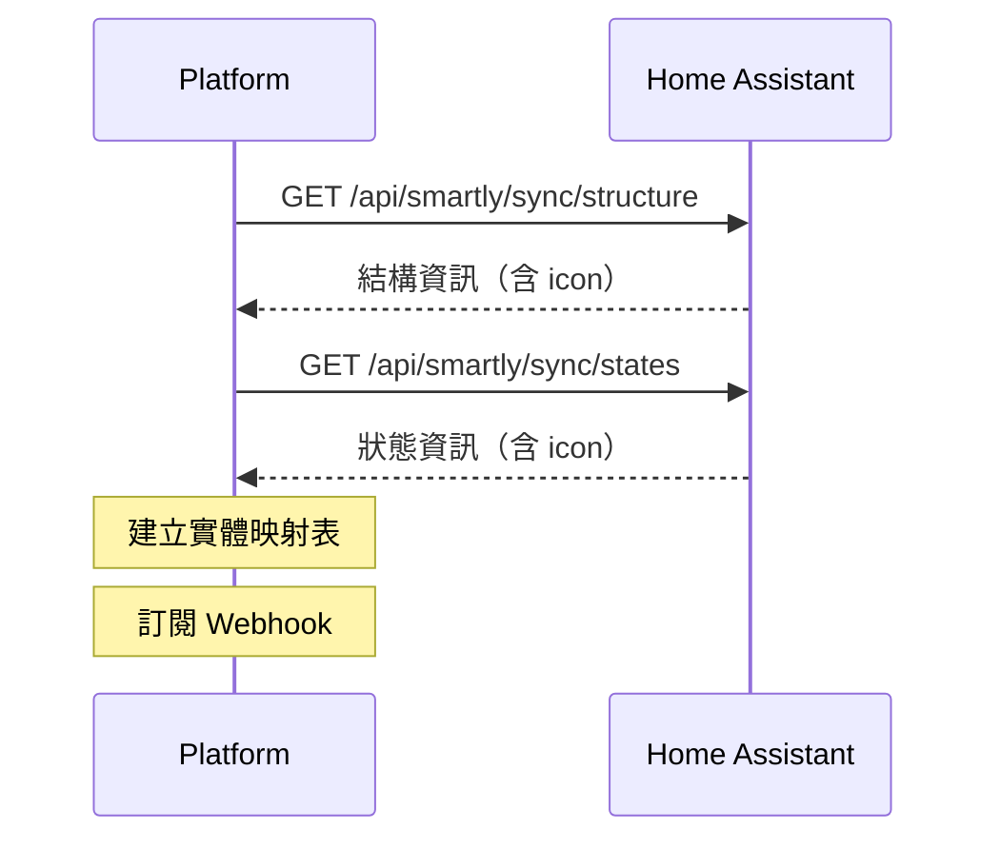

# Sync API 說明文件

## 概述

Sync API 提供兩個端點，用於同步 Home Assistant 實體的結構和狀態資訊到平台。

## 端點

### 1. 取得結構層級

#### 端點

```
GET /api/smartly/sync/structure
```

#### 說明

取得所有被授權實體的完整結構資訊，包括樓層、區域、裝置和實體的階層關係。

#### 認證

需要 HMAC-SHA256 簽章驗證，詳見[安全性](#安全性)章節。

#### 回應格式

```json
{
  "floors": [
    {
      "id": "floor_1",
      "name": "Ground Floor",
      "areas": [
        {
          "id": "area_1",
          "name": "Living Room",
          "devices": [
            {
              "id": "device_1",
              "name": "Smart Light Hub",
              "entities": [
                {
                  "entity_id": "light.living_room",
                  "domain": "light",
                  "name": "Living Room Light",
                  "icon": "mdi:lightbulb",
                  
                }
              ]
            }
          ]
        }
      ]
    }
  ],
  "areas": [
    {
      "id": "area_1",
      "name": "Living Room",
      "floor_id": "floor_1"
    }
  ],
  "devices": [
    {
      "id": "device_1",
      "name": "Smart Light Hub",
      "area_id": "area_1"
    }
  ],
  "entities": [
    {
      "entity_id": "light.living_room",
      "domain": "light",
      "name": "Living Room Light",
      "device_id": "device_1",
      "icon": "mdi:lightbulb",
      
    }
  ]
}
```

#### 欄位說明

##### Floor（樓層）

| 欄位 | 類型 | 說明 |
|------|------|------|
| `id` | string | 樓層 ID |
| `name` | string | 樓層名稱 |
| `areas` | array | 該樓層包含的區域列表 |

##### Area（區域）

| 欄位 | 類型 | 說明 |
|------|------|------|
| `id` | string | 區域 ID |
| `name` | string | 區域名稱 |
| `floor_id` | string \| null | 所屬樓層 ID |
| `devices` | array | 該區域包含的裝置列表（僅在階層結構中） |

##### Device（裝置）

| 欄位 | 類型 | 說明 |
|------|------|------|
| `id` | string | 裝置 ID |
| `name` | string | 裝置名稱 |
| `area_id` | string \| null | 所屬區域 ID |
| `entities` | array | 該裝置包含的實體列表（僅在階層結構中） |

##### Entity（實體）

| 欄位 | 類型 | 說明 |
|------|------|------|
| `entity_id` | string | 實體 ID（例如：`light.living_room`） |
| `domain` | string | 實體域（例如：`light`、`switch`） |
| `name` | string | 實體名稱 |
| `device_id` | string | 所屬裝置 ID |
| `icon` | string \| null | MDI 格式圖示，優先使用使用者自訂圖示，若無則自動使用原始圖示（例如：`mdi:lightbulb`） |

#### Icon 欄位說明

`icon` 欄位會自動處理 fallback 邏輯：
- 如果使用者有設定自訂圖示，則回傳自訂圖示
- 如果沒有自訂圖示，則自動回傳原始預設圖示
- 如果兩者都沒有，則為 `null`

這樣前端只需直接使用 `icon` 欄位，不需要額外的判斷邏輯。

#### 範例

**請求**

```bash
curl -X GET "https://your-ha-instance.com/api/smartly/sync/structure" \
  -H "X-Client-Id: your-client-id" \
  -H "X-Timestamp: 1735862400" \
  -H "X-Nonce: 550e8400-e29b-41d4-a716-446655440000" \
  -H "X-Signature: computed-hmac-signature"
```

**成功回應 (200 OK)**

```json
{
  "floors": [...],
  "areas": [...],
  "devices": [...],
  "entities": [...]
}
```

#### 錯誤回應

| 狀態碼 | 錯誤碼 | 說明 |
|--------|--------|------|
| 401 | `invalid_signature` | HMAC 簽章驗證失敗 |
| 401 | `timestamp_expired` | 時間戳記過期（超過 5 分鐘） |
| 401 | `nonce_already_used` | Nonce 已被使用過 |
| 429 | `rate_limited` | 超過速率限制 |
| 500 | `integration_not_configured` | 整合未正確設定 |

---

### 2. 取得實體狀態

#### 端點

```
GET /api/smartly/sync/states
```

#### 說明

取得所有被授權實體的即時狀態資訊，包括狀態值、屬性、時間戳記和圖示資訊。

#### 認證

需要 HMAC-SHA256 簽章驗證，詳見[安全性](#安全性)章節。

#### 回應格式

```json
{
  "states": [
    {
      "entity_id": "light.living_room",
      "state": "on",
      "attributes": {
        "brightness": 255,
        "color_temp": 400,
        "friendly_name": "Living Room Light"
      },
      "last_changed": "2026-01-09T10:30:00.000Z",
      "last_updated": "2026-01-09T10:30:00.000Z",
      "icon": "mdi:lightbulb"
    }
  ],
  "count": 1
}
```

#### 欄位說明

| 欄位 | 類型 | 說明 |
|------|------|------|
| `entity_id` | string | 實體 ID |
| `state` | string | 實體目前狀態（例如：`on`、`off`、`unavailable`） |
| `attributes` | object | 實體屬性（依實體類型而異） |
| `last_changed` | string \| null | 狀態最後改變時間（ISO 8601 格式） |
| `last_updated` | string \| null | 最後更新時間（ISO 8601 格式） |
| `icon` | string \| null | MDI 格式圖示，優先使用使用者自訂圖示，若無則自動使用原始圖示 |
| `count` | integer | 實體總數 |

#### 常見實體屬性

##### Light（燈光）

```json
{
  "brightness": 255,           // 亮度 (0-255)
  "color_temp": 400,          // 色溫 (Kelvin)
  "rgb_color": [255, 200, 100], // RGB 顏色
  "friendly_name": "Living Room Light"
}
```

##### Switch（開關）

```json
{
  "friendly_name": "Bedroom Switch"
}
```

##### Climate（空調）

```json
{
  "temperature": 22.5,        // 目標溫度
  "current_temperature": 23.0, // 目前溫度
  "hvac_mode": "cool",        // 模式
  "fan_mode": "auto"          // 風扇模式
}
```

##### Cover（窗簾）

```json
{
  "current_position": 50,     // 目前位置 (0-100)
  "friendly_name": "Bedroom Curtain"
}
```

#### 範例

**請求**

```bash
curl -X GET "https://your-ha-instance.com/api/smartly/sync/states" \
  -H "X-Client-Id: your-client-id" \
  -H "X-Timestamp: 1735862400" \
  -H "X-Nonce: 550e8400-e29b-41d4-a716-446655440001" \
  -H "X-Signature: computed-hmac-signature"
```

**成功回應 (200 OK)**

```json
{
  "states": [
    {
      "entity_id": "light.kitchen",
      "state": "on",
      "attributes": {
        "brightness": 200,
        "friendly_name": "Kitchen Light"
      },
      "last_changed": "2026-01-09T10:15:30.000Z",
      "last_updated": "2026-01-09T10:15:30.000Z",
      "icon": "mdi:ceiling-light"
    },
    {
      "entity_id": "switch.bedroom",
      "state": "off",
      "attributes": {
        "friendly_name": "Bedroom Switch"
      },
      "last_changed": "2026-01-09T09:00:00.000Z",
      "last_updated": "2026-01-09T09:00:00.000Z",
      "icon": "mdi:toggle-switch"
    }
  ],
  "count": 2
}
```

#### 錯誤回應

| 狀態碼 | 錯誤碼 | 說明 |
|--------|--------|------|
| 401 | `invalid_signature` | HMAC 簽章驗證失敗 |
| 401 | `timestamp_expired` | 時間戳記過期（超過 5 分鐘） |
| 401 | `nonce_already_used` | Nonce 已被使用過 |
| 429 | `rate_limited` | 超過速率限制 |
| 500 | `integration_not_configured` | 整合未正確設定 |

---

## 安全性

### HMAC-SHA256 簽章驗證

所有 Sync API 請求都需要 HMAC-SHA256 簽章驗證。

#### 必要標頭

| 標頭 | 類型 | 說明 |
|------|------|------|
| `X-Client-Id` | string | 客戶端識別碼 |
| `X-Timestamp` | string | Unix 時間戳記（秒） |
| `X-Nonce` | string | UUID v4 格式的隨機值 |
| `X-Signature` | string | HMAC-SHA256 簽章 |

#### 簽章計算

1. **建立簽章字串**

```
{method}\n{path}\n{timestamp}\n{nonce}\n{body}
```

- `method`: HTTP 方法（例如：`GET`）
- `path`: API 路徑（例如：`/api/smartly/sync/structure`）
- `timestamp`: Unix 時間戳記
- `nonce`: UUID v4 隨機值
- `body`: 請求 body（GET 請求為空字串）

2. **計算 HMAC-SHA256**

```python
import hmac
import hashlib

signature = hmac.new(
    client_secret.encode('utf-8'),
    signature_string.encode('utf-8'),
    hashlib.sha256
).hexdigest()
```

#### Python 範例

```python
import hmac
import hashlib
import time
import uuid
import requests

# 設定
CLIENT_ID = "your-client-id"
CLIENT_SECRET = "your-client-secret"
BASE_URL = "https://your-ha-instance.com"

# 建立簽章
method = "GET"
path = "/api/smartly/sync/structure"
timestamp = str(int(time.time()))
nonce = str(uuid.uuid4())
body = ""

signature_string = f"{method}\n{path}\n{timestamp}\n{nonce}\n{body}"
signature = hmac.new(
    CLIENT_SECRET.encode('utf-8'),
    signature_string.encode('utf-8'),
    hashlib.sha256
).hexdigest()

# 發送請求
headers = {
    "X-Client-Id": CLIENT_ID,
    "X-Timestamp": timestamp,
    "X-Nonce": nonce,
    "X-Signature": signature,
}

response = requests.get(f"{BASE_URL}{path}", headers=headers)
print(response.json())
```

#### 安全性注意事項

1. **Nonce 唯一性**: 每個 nonce 在 5 分鐘內只能使用一次，防止重放攻擊
2. **時間戳記驗證**: 時間戳記必須在當前時間的 ±5 分鐘內
3. **HTTPS 必須**: 生產環境必須使用 HTTPS 傳輸
4. **金鑰安全**: `client_secret` 必須安全儲存，不可外洩

---

## 速率限制

- **限制**: 60 次請求 / 分鐘（每個 client_id）
- **超過限制**: 回傳 `429 Too Many Requests`
- **重試**: 檢查 `Retry-After` 標頭（秒）

**範例回應**

```json
{
  "error": "rate_limited"
}
```

**回應標頭**

```
Retry-After: 60
X-RateLimit-Remaining: 0
```

---

## 使用建議

### 1. 初始同步流程



### 2. 圖示顯示邏輯

```python
def get_display_icon(entity):
    """取得要顯示的圖示"""
    # 直接使用 icon 欄位（已包含 fallback 邏輯）
    if entity.get('icon'):
        return entity['icon']
    
    # 如果 icon 為 null，根據 domain 提供預設圖示
    default_icons = {
        'light': 'mdi:lightbulb',
        'switch': 'mdi:toggle-switch',
        'climate': 'mdi:thermostat',
        'cover': 'mdi:window-shutter',
        'lock': 'mdi:lock',
    }
    return default_icons.get(entity.get('domain'), 'mdi:help-circle')
```

### 3. 差異更新

建議使用 Webhook 接收即時狀態更新，而非輪詢 `/sync/states`：

- **初始化**: 使用 `/sync/structure` 和 `/sync/states` 建立完整快照
- **即時更新**: 訂閱 `stateChanged` webhook 接收增量更新
- **定期同步**: 每 5-10 分鐘執行一次完整同步以確保一致性

---

## 版本記錄

### v1.1.0 (2026-01-09)

- ✨ 新增 `icon` 和 `original_icon` 欄位到 structure 和 states API
- 📝 更新文件說明 icon 欄位的使用方式

### v1.0.0

- 🎉 初始版本發布
- 🔒 HMAC-SHA256 認證
- 📊 Structure 和 States API

---

## 相關文件

- [Control API 說明](control/README.md)
- [Camera API 說明](camera-api.md)
- [安全審計報告](security-audit.md)
- [故障排除](control/troubleshooting.md)
